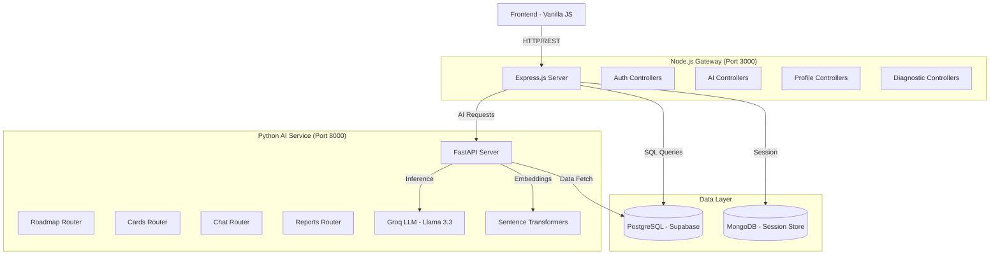

## Architecture Overview

Kairo uses a **hybrid microservices architecture** that combines the strengths of Node.js for orchestration and Python for AI processing. This separation of concerns ensures scalability, maintainability, and optimal performance for both real-time operations and compute-intensive AI tasks.

<Note>
  **Design Philosophy:**
  - Node.js handles business logic, authentication, and real-time requests
  - Python focuses exclusively on AI inference and data science
  - PostgreSQL (Supabase) serves as the single source of truth
  - Services communicate via HTTP REST APIs
</Note>

---

## System Components

<CardGroup cols={3}>
  <Card title="Node.js Gateway" icon="node-js">
    **Port:** 3000
    
    Express.js API handling:
    - User authentication
    - Session management
    - Business logic
    - Request orchestration
  </Card>

  <Card title="Python AI Service" icon="python">
    **Port:** 8000
    
    FastAPI microservice for:
    - Learning plan generation
    - Exercise creation
    - Report analytics
    - Embeddings & RAG
  </Card>

  <Card title="PostgreSQL Database" icon="database">
    **Provider:** Supabase
    
    Stores:
    - User profiles
    - Learning plans
    - Moodle data
    - AI generation logs
  </Card>
</CardGroup>

---

## High-Level Architecture Diagram



---

## Node.js Backend Architecture

### Tech Stack

```json backend-node/package.json
{
  "name": "learning-platform",
  "version": "1.0.0",
  "type": "module",
  "dependencies": {
    "express": "^5.2.1",
    "@supabase/supabase-js": "^2.98.0",
    "passport": "^0.7.0",
    "passport-google-oauth20": "^2.0.0",
    "passport-github2": "^0.1.12",
    "express-session": "^1.19.0",
    "bcrypt": "^6.0.0",
    "pg": "^8.18.0",
    "mongoose": "^9.3.0",
    "nodemailer": "^6.10.1",
    "cors": "^2.8.6",
    "morgan": "^1.10.1"
  }
}
```

### Directory Structure

```bash
backend-node/
├── src/
│   ├── config/
│   │   ├── database.js       # PostgreSQL connection pool
│   │   ├── mongodb.js        # Session store configuration
│   │   ├── passport.js       # OAuth strategies (Google, GitHub)
│   │   └── supabase.js       # Supabase client initialization
│   ├── controllers/
│   │   ├── authControllers.js        # Registration, login, OTP
│   │   ├── iaControllers.js          # AI orchestration
│   │   ├── profileControllers.js     # User profile management
│   │   ├── diagnosticControllers.js  # Soft skills assessment
│   │   └── ...
│   ├── middlewares/
│   │   └── authMiddlewares.js        # isAuthenticated, hasRole
│   ├── models/
│   │   ├── user.js                   # User schema
│   │   ├── plan.js                   # Learning plan schema
│   │   └── ...
│   ├── routes/
│   │   ├── authRoutes.js
│   │   ├── iaRoutes.js
│   │   ├── profileRoutes.js
│   │   └── ...
│   ├── services/
│   │   ├── pythonApiService.js       # Python API client
│   │   ├── email.service.js          # OTP email sender
│   │   └── notificationService.js
│   ├── utils/
│   │   ├── helpers.js
│   │   ├── validators.js
│   │   └── onboarding-logic.js
│   └── server.js                     # Application entry point
└── package.json
```

### Server Bootstrap

```javascript backend-node/src/server.js:121-146
async function startServer() {
  try {
    process.stdout.write('🔄 Initializing Kairo services... ');
    await testConnection();      // PostgreSQL health check
    await connectMongo();         // MongoDB session store
    
    app.listen(PORT, '0.0.0.0', () => {
      console.log('DONE');
      console.log('------------------------------------------------------------');
      console.log('🚀 KAIRO API GATEWAY STARTED SUCCESSFULLY');
      console.log('------------------------------------------------------------');
      console.log(`📡 URL      : http://localhost:${PORT}`);
      console.log(`🌐 Origins  : ${ALLOWED_ORIGINS.join(', ')}`);
      console.log(`🛠️  ENV      : ${process.env.NODE_ENV || 'development'}`);
      console.log('------------------------------------------------------------');
    });
  } catch (error) {
    console.error('FAILED', error);
    process.exit(1);
  }
}
```

### Route Configuration

```javascript backend-node/src/server.js:80-87
app.use('/api/auth', authRoutes);              // Authentication & sessions
app.use('/api/diagnostics', diagnosticRoutes);  // Soft skills assessment
app.use('/api/coder', coderRoutes);            // Coder-specific features
app.use('/api/tl', tlRoutes);                  // Team Leader dashboard
app.use('/api/ai', aiRoutes);                  // AI orchestration
app.use('/api/notifications', notificationRoutes);
app.use('/api/profile', profileRoutes);
app.use('/api', assignmentRoutes);
```

### Authentication Flow

<Steps>
  <Step title="Session Configuration">
    ```javascript backend-node/src/server.js:59-72
    app.use(
      session({
        name: 'riwi.sid',
        secret: process.env.SESSION_SECRET || 'dev_secret_fallback',
        resave: false,
        saveUninitialized: false,
        cookie: {
          secure: isProduction,              // HTTPS only in production
          httpOnly: true,                     // Prevent XSS
          maxAge: 24 * 60 * 60 * 1000,       // 24 hours
          sameSite: isProduction ? 'none' : 'lax'
        }
      })
    );
    ```
  </Step>

  <Step title="Passport Strategies">
    Kairo supports three authentication methods:
    
    1. **Email + Password** (with OTP verification)
    2. **Google OAuth 2.0**
    3. **GitHub OAuth**

    ```javascript backend-node/src/config/passport.js
    passport.use(
      new GoogleStrategy(
        {
          clientID: process.env.GOOGLE_CLIENT_ID,
          clientSecret: process.env.GOOGLE_CLIENT_SECRET,
          callbackURL: '/api/auth/google/callback'
        },
        async (accessToken, refreshToken, profile, done) => {
          // Find or create user logic
        }
      )
    );
    ```
  </Step>

  <Step title="Middleware Protection">
    ```javascript backend-node/src/middlewares/authMiddlewares.js
    export const isAuthenticated = (req, res, next) => {
      if (!req.session.userId) {
        return res.status(401).json({ error: 'Unauthorized' });
      }
      next();
    };

    export const hasRole = (...allowedRoles) => {
      return (req, res, next) => {
        if (!allowedRoles.includes(req.user.role)) {
          return res.status(403).json({ error: 'Forbidden' });
        }
        next();
      };
    };
    ```
  </Step>
</Steps>

### Database Connection

```javascript backend-node/src/config/database.js:39-53
const pool = new Pool({
  connectionString: buildConnectionString(),
  ssl: process.env.DB_SSL === 'false' ? false : { rejectUnauthorized: false },
  
  // Resource Management
  max: 10,                        // Maximum concurrent connections
  idleTimeoutMillis: 30000,       // Close idle clients after 30s
  connectionTimeoutMillis: 30000, // Fail fast if connection takes >30s
  
  // Query Performance
  statement_timeout: 30000        // Terminate queries exceeding 30s
});
```

---

## Python AI Service Architecture

### Tech Stack

```txt backend-python/requirements.txt
fastapi==0.115.0
uvicorn==0.30.6
supabase==2.7.4
groq==1.1.1
pydantic==2.9.2
sentence-transformers==3.0.1
torch==2.4.1
python-dotenv==1.0.1
httpx==0.27.2
```

### Directory Structure

```bash
backend-python/
├── app/
│   ├── routers/
│   │   ├── roadmap.py        # POST /generate-plan
│   │   ├── cards.py          # POST /generate-focus-cards
│   │   ├── chat.py           # POST /chat/ask
│   │   ├── reports.py        # POST /generate-report
│   │   └── exercises.py      # Exercise generation & validation
│   ├── services/
│   │   ├── ia_services.py           # LLM orchestration
│   │   ├── supabase_service.py      # Database queries
│   │   ├── embedding_service.py     # Vector embeddings
│   │   └── prompt_builder.py        # Dynamic prompt generation
│   ├── models/
│   │   ├── plan_request.py          # Pydantic schemas
│   │   └── coder_profile.py
│   └── __init__.py
├── main.py                    # FastAPI application
└── requirements.txt
```

### FastAPI Application

```python backend-python/main.py:50-71
app = FastAPI(
    title="Kairo AI Service",
    description="AI microservice for Riwi — plans, exercises, resources RAG, and TL reports.",
    version="2.2.0",
    lifespan=lifespan
)

app.add_middleware(
    CORSMiddleware,
    allow_origins=_build_origins(),
    allow_credentials=True,
    allow_methods=["GET", "POST", "DELETE", "OPTIONS"],
    allow_headers=["Content-Type", "Authorization"]
)

# Routers
app.include_router(roadmap.router)    # POST /generate-plan
app.include_router(cards.router)      # POST /generate-focus-cards
app.include_router(chat.router)       # POST /chat/ask
app.include_router(reports.router)    # POST /generate-report
app.include_router(exercises.router)  # POST /generate-exercise
```

### AI Model Configuration

```python backend-python/main.py:38-45
@asynccontextmanager
async def lifespan(app: FastAPI):
    logger.info("━━━━━━━━━━━━━━━━━━━━━━━━━━━━━━━━━━━━")
    logger.info("  Kairo AI Service v2.2  |  starting")
    logger.info(f"  LLM model  : {os.getenv('MODEL_NAME', 'llama-3.3-70b-versatile')}")
    logger.info(f"  Embeddings : {'✓ all-MiniLM-L6-v2 (384d)' if model_ready() else '✗ NOT LOADED'}")
    logger.info(f"  Env        : {os.getenv('ENV', 'development')}")
    yield
```

<Note>
  **AI Model Details:**
  - **LLM**: Llama 3.3 70B via Groq API (optimized for low-latency inference)
  - **Embeddings**: all-MiniLM-L6-v2 (384 dimensions) for semantic search
  - **Provider**: Groq (ultra-fast LLM inference)
</Note>

---

## Inter-Service Communication

### Node.js → Python: AI Request Flow

<Steps>
  <Step title="Node.js Receives Client Request">
    ```javascript backend-node/src/routes/iaRoutes.js:17
    router.post('/generate-plan', hasRole('coder'), generatePlan);
    ```
  </Step>

  <Step title="Node.js Prepares Context">
    ```javascript backend-node/src/controllers/iaControllers.js:26-64
    export const generatePlan = async (req, res) => {
      const user = req.user;
      
      // Fetch minimal context from Supabase
      const { data: moodleProgress } = await supabase
        .from('moodle_progress')
        .select('module_id, current_week, struggling_topics')
        .eq('coder_id', user.id)
        .single();
      
      const moduleId = moodleProgress?.module_id ?? 1;
      const currentWeek = moodleProgress?.current_week ?? 1;
      
      // Build slim payload for Python
      const payload = {
        coder_id: user.id,
        module_id: moduleId,
        topic: req.body.topic ?? `Módulo ${moduleId} — Semana ${currentWeek}`,
        struggling_topics: strugglingNames,
        additional_topics: req.body.additionalTopics ?? []
      };
      
      // Delegate to Python
      const aiResponse = await callPythonApi('/generate-plan', payload);
    }
    ```
  </Step>

  <Step title="Python API Client with Timeout">
    ```javascript backend-node/src/services/pythonApiService.js:18-42
    export async function callPythonApi(endpoint, data) {
      const timeoutMs = HEAVY_ENDPOINTS.includes(endpoint)
        ? 60_000  // 60s for /generate-plan, /generate-exercises
        : 30_000; // 30s for other endpoints
      
      const controller = new AbortController();
      const timer = setTimeout(() => controller.abort(), timeoutMs);
      
      try {
        const response = await fetch(`${PYTHON_API_URL}${endpoint}`, {
          method: 'POST',
          headers: { 'Content-Type': 'application/json' },
          body: JSON.stringify(data),
          signal: controller.signal
        });
        
        if (!response.ok) {
          throw new Error(`Python API error: ${response.status}`);
        }
        
        return await response.json();
      } catch (error) {
        // Handle timeout, connection errors
      } finally {
        clearTimeout(timer);
      }
    }
    ```
  </Step>

  <Step title="Python Processes Request">
    ```python backend-python/app/routers/roadmap.py:34-96
    @router.post("/generate-plan")
    async def generate_plan(req: GeneratePlanRequest):
        # 1. Fetch soft skills from Supabase
        soft_skills = db_manager.get_soft_skills(req.coder_id)
        
        # 2. Fetch module data and weeks
        module = db_manager.get_module(req.module_id)
        weeks = db_manager.get_weeks(req.module_id)
        
        # 3. Deactivate previous active plans
        db_manager.deactivate_plans(req.coder_id)
        
        # 4. Build context for AI
        context = {
            "plan_type": req.plan_type,
            "coder_id": req.coder_id,
            "soft_skills": soft_skills,
            "module": module,
            "weeks": weeks,
            "current_week": req.current_week
        }
        
        # 5. Generate plan with LLM
        plan = await generate_plan_with_ai(context)
        
        # 6. Persist to database
        plan_id = db_manager.save_plan(
            coder_id=req.coder_id,
            module_id=req.module_id,
            plan=plan,
            soft_skills_snapshot=soft_skills,
            targeted_soft_skill=plan.get("targeted_soft_skill")
        )
        
        return {"success": True, "plan_id": plan_id, "plan": plan}
    ```
  </Step>

  <Step title="Node.js Returns to Client">
    ```javascript backend-node/src/controllers/iaControllers.js:81-85
    return res.status(200).json({
      success: true,
      plan: aiResponse.plan,
      metadata: aiResponse.metadata
    });
    ```
  </Step>
</Steps>

---

## Data Architecture

### Database Schema (PostgreSQL)

<CodeGroup>
```sql Users Table
CREATE TABLE users (
  id SERIAL PRIMARY KEY,
  email VARCHAR(255) UNIQUE NOT NULL,
  password VARCHAR(255),
  full_name VARCHAR(255) NOT NULL,
  role role_enum NOT NULL DEFAULT 'coder',
  clan INTEGER REFERENCES clans(id),
  first_login BOOLEAN DEFAULT TRUE,
  otp_verified BOOLEAN DEFAULT FALSE,
  created_at TIMESTAMP DEFAULT NOW()
);

CREATE TYPE role_enum AS ENUM ('coder', 'tl', 'admin');
```

```sql Learning Plans Table
CREATE TABLE plans (
  id SERIAL PRIMARY KEY,
  coder_id INTEGER REFERENCES users(id) ON DELETE CASCADE,
  module_id INTEGER REFERENCES modules(id),
  plan JSONB NOT NULL,
  plan_type VARCHAR(20) DEFAULT 'interpretive',
  soft_skills_snapshot JSONB,
  moodle_status_snapshot JSONB,
  targeted_soft_skill VARCHAR(50),
  is_active BOOLEAN DEFAULT TRUE,
  created_at TIMESTAMP DEFAULT NOW()
);
```

```sql Moodle Progress Table
CREATE TABLE moodle_progress (
  id SERIAL PRIMARY KEY,
  coder_id INTEGER REFERENCES users(id) ON DELETE CASCADE,
  module_id INTEGER REFERENCES modules(id),
  current_week INTEGER DEFAULT 1,
  average_score DECIMAL(5,2) DEFAULT 0.00,
  struggling_topics INTEGER[] DEFAULT '{}',
  updated_at TIMESTAMP DEFAULT NOW()
);
```

```sql AI Generation Log
CREATE TABLE ai_generation_log (
  id SERIAL PRIMARY KEY,
  coder_id INTEGER REFERENCES users(id),
  agent_type ai_agent_enum NOT NULL,
  input_payload JSONB,
  output_payload JSONB,
  model_name VARCHAR(100),
  execution_time_ms INTEGER,
  success BOOLEAN DEFAULT TRUE,
  created_at TIMESTAMP DEFAULT NOW()
);

CREATE TYPE ai_agent_enum AS ENUM (
  'plan_generator',
  'exercise_generator',
  'report_generator',
  'focus_cards'
);
```
</CodeGroup>

### Data Flow Patterns

<Accordion title="User Registration & OTP Verification">
  1. Client submits registration form
  2. Node.js validates input and hashes password
  3. OTP generated and sent via Nodemailer (SMTP)
  4. Registration data staged in `req.session.pendingRegistration`
  5. User submits OTP code
  6. On success: Insert into `users` table with `otp_verified: true`
  7. Session created with Passport.js
</Accordion>

<Accordion title="Learning Plan Generation">
  1. Client clicks "Generate Plan"
  2. Node.js fetches `moodle_progress` for coder
  3. Node.js sends slim payload to Python: `{coder_id, module_id, struggling_topics}`
  4. Python fetches full context from Supabase:
     - Soft skills from `soft_skills` table
     - Module details from `modules` table
     - Week breakdown from `module_weeks` table
  5. Python builds dynamic prompt and calls Groq LLM
  6. Python validates JSON output schema
  7. Python persists plan to `plans` table
  8. Python returns plan to Node.js
  9. Node.js logs generation to `ai_generation_log`
  10. Client receives plan with metadata
</Accordion>

<Accordion title="Weekly Analytical Plan (Cron Job)">
  1. Monday 00:00 UTC: Cron triggers
  2. For each active coder:
     - Fetch last week's Moodle data
     - Calculate `average_score` and identify `struggling_topics`
     - Update `moodle_progress` table
  3. Call Python `/generate-plan` with:
     ```json
     {
       "plan_type": "analytical",
       "coder_id": 42,
       "module_id": 3,
       "current_week": 2,
       "average_score": 72.5,
       "struggling_topics": ["Async/Await", "Closures"],
       "weeks_completed": [{...}]
     }
     ```
  4. Python generates adaptive plan based on performance
  5. Previous plan set to `is_active: false`
  6. New plan activated on dashboard
</Accordion>

---

## Security Architecture

### Authentication Layers

<Steps>
  <Step title="CORS Protection">
    ```javascript backend-node/src/server.js:30-44
    const ALLOWED_ORIGINS = isProduction
      ? [process.env.FRONTEND_URL].filter(Boolean)
      : ['http://localhost:5500', 'http://localhost:5173'];

    const corsOptions = {
      origin(origin, callback) {
        if (!origin) return callback(null, true);
        if (ALLOWED_ORIGINS.includes(origin)) return callback(null, true);
        callback(new Error(`CORS: origin '${origin}' not allowed`));
      },
      credentials: true,
      methods: ['GET', 'POST', 'PUT', 'PATCH', 'DELETE', 'OPTIONS'],
      allowedHeaders: ['Content-Type', 'Authorization']
    };
    ```
  </Step>

  <Step title="Password Hashing">
    ```javascript backend-node/src/controllers/authControllers.js:24
    const hashedPassword = await bcrypt.hash(password, 10);
    ```

    Bcrypt with cost factor 10 (2^10 = 1024 iterations)
  </Step>

  <Step title="OTP Rate Limiting">
    - Max 5 verification attempts per session
    - Max 3 resend requests per 10 minutes
    - 15-minute expiration window
    - Codes invalidated after use
  </Step>

  <Step title="Session Security">
    - `httpOnly`: Prevents XSS attacks on cookies
    - `secure`: HTTPS-only in production
    - `sameSite`: CSRF protection
    - 24-hour expiration
  </Step>

  <Step title="Role-Based Access Control (RBAC)">
    ```javascript backend-node/src/routes/iaRoutes.js
    router.post('/generate-plan', hasRole('coder'), generatePlan);
    router.post('/generate-report', hasRole('tl'), generateReport);
    ```

    Roles: `coder`, `tl` (Team Leader), `admin`
  </Step>
</Steps>

### Database Security

- **SSL Encryption**: All PostgreSQL connections use SSL
- **Connection Pooling**: Max 10 concurrent connections
- **Query Timeout**: 30-second limit prevents long-running queries
- **Prepared Statements**: Protection against SQL injection
- **Row Level Security (RLS)**: Supabase policies enforce data isolation

---

## Performance Optimizations

### Node.js Optimizations

<Card title="Connection Pooling" icon="gauge-high">
  ```javascript backend-node/src/config/database.js:39-52
  const pool = new Pool({
    max: 10,                        // Reuse connections
    idleTimeoutMillis: 30000,       // Close idle connections
    connectionTimeoutMillis: 30000, // Fast failure
    statement_timeout: 30000        // Query timeout
  });
  ```
</Card>

<Card title="Session Store" icon="database">
  MongoDB session store prevents database bloat:
  ```javascript backend-node/src/config/mongodb.js
  mongoose.connect(process.env.MONGODB_URI, {
    maxPoolSize: 10,
    serverSelectionTimeoutMS: 5000
  });
  ```
</Card>

### Python Optimizations

<Card title="Model Caching" icon="memory">
  Embeddings model loaded once at startup:
  ```python backend-python/app/services/embedding_service.py
  from sentence_transformers import SentenceTransformer
  
  model = SentenceTransformer('all-MiniLM-L6-v2')
  # Cached in memory for all requests
  ```
</Card>

<Card title="Async Processing" icon="bolt">
  ```python backend-python/app/routers/roadmap.py:34
  @router.post("/generate-plan")
  async def generate_plan(req: GeneratePlanRequest):
      plan = await generate_plan_with_ai(context)  # Non-blocking
  ```
</Card>

<Card title="Timeout Management" icon="clock">
  Heavy endpoints get extended timeouts:
  ```javascript backend-node/src/services/pythonApiService.js:7-11
  const TIMEOUTS = {
    default: 30_000,   // 30 seconds
    heavy:   60_000    // 60 seconds for /generate-plan
  };
  ```
</Card>

---

## Deployment Architecture

### Development Environment

```bash
# Terminal 1: Node.js Gateway
cd backend-node
npm install
npm run dev
# → Runs on http://localhost:3000

# Terminal 2: Python AI Service
cd backend-python
python3 -m venv env
source env/bin/activate
pip install -r requirements.txt
uvicorn main:app --host 0.0.0.0 --port 8000 --reload
# → Runs on http://localhost:8000

# Terminal 3: Frontend
cd frontend
npx serve -p 5500
# → Runs on http://localhost:5500
```

### Production Considerations

<Warning>
  **Pre-Production Checklist:**
  - Set `NODE_ENV=production`
  - Use environment variables for all secrets
  - Enable HTTPS (SSL certificates)
  - Configure `secure: true` for session cookies
  - Set up reverse proxy (nginx/Caddy)
  - Enable database connection pooling
  - Configure CORS for production domains only
  - Set up monitoring (logs, error tracking)
  - Enable rate limiting on API endpoints
</Warning>

---

## Monitoring & Health Checks

### Node.js Health Endpoint

```javascript backend-node/src/server.js:89-100
app.get('/api/health', async (req, res) => {
  try {
    const result = await pool.query('SELECT NOW()');
    res.json({
      status: 'active',
      uptime: process.uptime(),
      database: { connected: true, timestamp: result.rows[0].now }
    });
  } catch (error) {
    res.status(503).json({ status: 'unstable', error: error.message });
  }
});
```

### Python Health Endpoint

```python backend-python/main.py:74-82
@app.get("/health", tags=["Infrastructure"])
async def health_check():
    return {
        "status":      "online",
        "service":     "Kairo AI Engine",
        "model":       os.getenv("MODEL_NAME", "llama-3.3-70b-versatile"),
        "embeddings":  "all-MiniLM-L6-v2" if model_ready() else "unavailable",
        "environment": os.getenv("ENV", "development")
    }
```

### Composite Health Check

```javascript backend-node/src/controllers/iaControllers.js:198-206
export const checkAiHealth = async (req, res) => {
  try {
    const response = await fetch(`${PYTHON_API_URL}/health`);
    const data = await response.json();
    return res.status(200).json({ node: 'ok', python: data });
  } catch (error) {
    return res.status(503).json({ 
      node: 'ok', 
      python: 'unreachable', 
      error: error.message 
    });
  }
};
```

---

## API Versioning Strategy

<Note>
  **Current Version:** v1.0.0 (Node.js) | v2.2.0 (Python)
  
  The platform uses **implicit versioning** via the `/api/` prefix. Future versions will introduce `/api/v2/` endpoints while maintaining backward compatibility.
</Note>

---

## Error Handling Patterns

### Node.js Error Middleware

```javascript backend-node/src/server.js:107-116
app.use((err, req, res, next) => {
  const status = err.status || 500;
  console.error(`[System Error] ${err.stack}`);
  
  res.status(status).json({
    error: true,
    message: isProduction ? 'Internal Server Error' : err.message
  });
});
```

### Python Exception Handling

```python backend-python/app/routers/roadmap.py:46-50
if req.plan_type not in ("interpretive", "analytical"):
    raise HTTPException(
        status_code=400,
        detail=f"plan_type must be 'interpretive' or 'analytical', got '{req.plan_type}'"
    )
```

---

## Technology Decisions

### Why Node.js for the Gateway?

✅ **Event-driven architecture** ideal for I/O-heavy operations  
✅ **Rich ecosystem** (Passport.js, Express middleware)  
✅ **Fast JSON processing** for API orchestration  
✅ **WebSocket support** for future real-time features  

### Why Python for AI?

✅ **Native AI/ML library support** (PyTorch, Transformers)  
✅ **Groq SDK** optimized for Python  
✅ **Data science tooling** (NumPy, Pandas)  
✅ **FastAPI performance** rivals Node.js for async workloads  

### Why Hybrid Architecture?

✅ **Separation of concerns**: Business logic ≠ AI processing  
✅ **Independent scaling**: Scale AI service separately  
✅ **Technology flexibility**: Use best tool for each job  
✅ **Team specialization**: Frontend/Backend vs. Data Science  

---

## Next Steps

<CardGroup cols={2}>
  <Card title="Quickstart Guide" icon="rocket" href="/quickstart">
    Set up your development environment and run the platform locally
  </Card>
  
  <Card title="API Reference" icon="code" href="/api/auth/overview">
    Complete endpoint documentation with request/response examples
  </Card>
  
  <Card title="Database Setup" icon="database" href="/setup/database-setup">
    Detailed table structure and relationships
  </Card>
  
  <Card title="AI Configuration" icon="brain" href="/setup/ai-configuration">
    How the LLM generates personalized learning plans
  </Card>
</CardGroup>